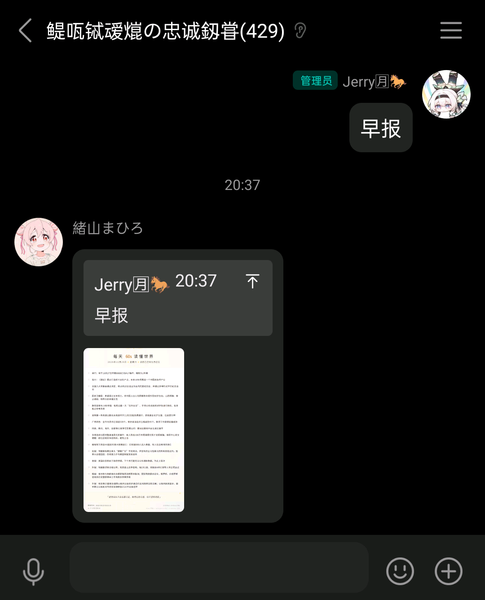
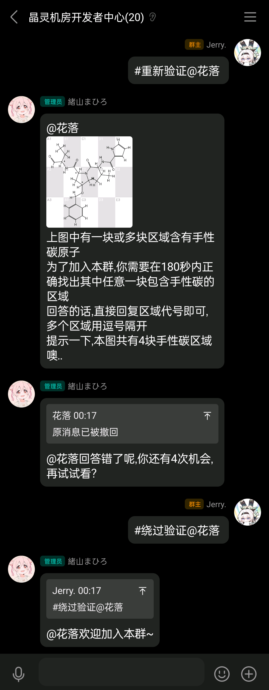
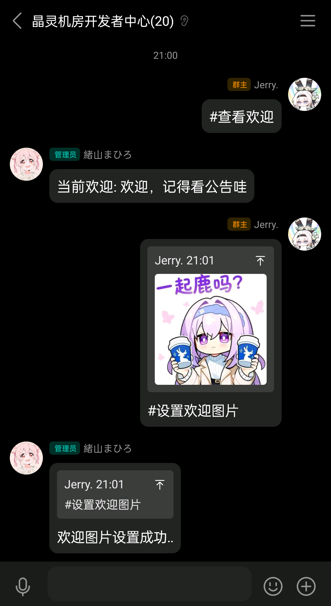
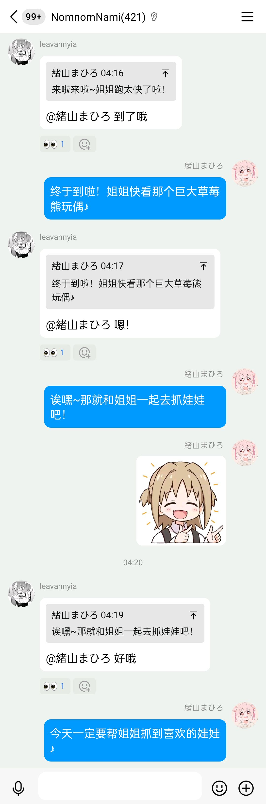
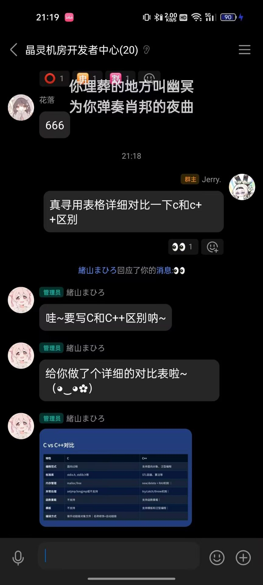
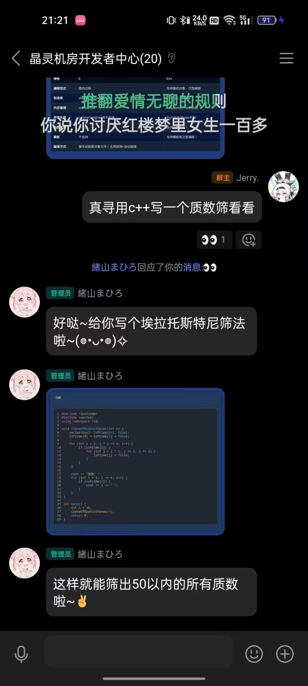

# crystelf-plugin

> 面向 Yunzai 生态的多功能群聊插件，集群聊互动、AI 对话、RSS、点歌、本地控制台与网页调试沙箱于一体。

crystelf-plugin 不只是一个“功能堆叠”的娱乐插件，它更偏向一个可持续扩展的群聊能力集合：

- 日常使用时，它可以承担欢迎、验证、戳一戳互动、RSS 推送、点歌等常规群功能
- 接入 AI 后，它可以继续扩展到多轮对话、多模态识图、联网搜索、网页正文读取、TTS 语音等能力
- 遇到问题时，还可以直接通过本地 Web 控制台查看状态、管理配置、排查日志，并在网页调试沙箱里安全调试

如果你希望一个插件同时覆盖“群内互动 + AI 能力 + 可视化调试”这三类需求，这个项目就是为这种场景设计的。

## 快速导航

- [3 分钟上手](#3-分钟上手)
- [本地 Web 控制台](#本地-web-控制台)
- [网页调试沙箱](#网页调试沙箱)
- [AI 能力](#ai-能力)
- [可用功能](#可用功能)
- [常见问题](#常见问题)

## 一句话看懂

| 方向 | 可以直接做什么 |
|---|---|
| 群聊运营 | 欢迎、验证、戳一戳、早晚安、RSS、点歌等常规群功能 |
| AI 能力 | 多轮对话、多模态识图、联网搜索、网页读取、TTS、表情包等扩展能力 |
| 可视化调试 | 本地 Web 控制台、登录鉴权、配置管理、网页调试沙箱、链路排障 |
| 按需启用 | 可以先只开基础群功能，再逐步补齐 AI、搜索、语音和其他模块 |

## 为什么适合长期用

- 一套插件覆盖群聊互动、AI 能力和可视化调试，不需要再拆成多套零散插件维护
- 本地 Web 控制台可直接承担配置管理、状态查看、问题排查和网页调试
- 支持登录鉴权、敏感信息脱敏和调试沙箱，适合长期维护而不只是一次性试玩
- 能力可以按模块逐步启用，先跑基础群功能，再继续补 AI、搜索、网页读取和 TTS

## 适合这三类场景

| 场景 | 适合谁 | 推荐起步方式 |
|---|---|---|
| 基础群功能 | 想先上欢迎、验证、戳一戳、RSS、点歌等模块的群 | 先启用基础群功能，再按需补 AI |
| AI 增强群聊 | 已有模型接口，准备接入对话和工具链的使用者 | 先补齐 `ai.*`，再逐步启用搜索、网页读取、TTS 和表情包能力 |
| 维护与排障 | 需要快速定位配置和运行问题的维护者、二次开发者 | 直接使用本地 Web 控制台和网页调试沙箱检查状态与链路 |

## 3 分钟上手

1. 将插件克隆到 `./plugins/crystelf-plugin`
2. 在 `Yunzai` 根目录安装依赖并启动 Bot
3. 先用锅巴或本地 Web 控制台完成基础配置
4. 如果要启用 AI，对话至少补齐 `ai.baseApi`、`ai.apiKey`、`ai.modelType`
   - `ai.baseApi` 一般写成 `https://xx.xx.com/v1`，不要填写到 `/chat/completions`
5. 打开本地控制台检查运行状态，再按需继续配置搜索、网页读取、TTS 等扩展能力

## 安装方法

- 使用 GitHub

  ```bash
  git clone --depth=1 https://github.com/Jerryplusy/crystelf-plugin ./plugins/crystelf-plugin
  ```

- 使用 Crystelf-Gitea 镜像（更新可能滞后）

  ```bash
  git clone --depth=1 https://git.crystelf.top/Jerry/crystelf-plugin ./plugins/crystelf-plugin
  ```

### 安装依赖

在 `Yunzai` 根目录下执行：

- npm

  ```bash
  npm install
  ```

- pnpm

  ```bash
  pnpm install
  ```

## 按场景补齐配置

- 只想先跑基础群功能
  - 先用锅巴或本地 Web 控制台完成主开关配置即可
- 想启用 AI 对话
  - 至少补齐 `ai.baseApi`、`ai.apiKey`、`ai.modelType`
  - `ai.baseApi` 推荐按 `https://xx.xx.com/v1` 这种 OpenAI 兼容基础地址格式填写
- 想启用联网搜索和网页读取
  - 继续填写 `coreConfig.tools.search.*`
- 想启用语音能力
  - 继续填写 `coreConfig.tools.tts.*`

### 推荐配置路径

- 优先使用锅巴配置页
- 其次使用本地 Web 控制台里的设置页
- 只有在明确知道运行时配置路径时，再直接修改 `Yunzai/data/crystelf/*.json`

## 配置说明

### 配置文件分层

| 配置文件 | 主要用途 |
|---|---|
| `config/config.json` | 主开关配置、Web 控制台配置、各功能启停 |
| `config/ai.json` | AI 对话、多模态、画像、人性化等配置 |
| `config/coreConfig.json` | AI 用量控制、搜索工具、网页转 Markdown、TTS 语音工具 |
| 其他配置 | `auth.json`、`music.json`、`feeds.json`、`newcomer.json` 等分别管理对应功能 |

### 运行时配置说明

- 插件启动后会将默认配置同步到运行时数据目录。
- **实际生效的通常是运行时配置，不一定是插件目录下的默认配置文件。**
- 默认运行时配置目录通常是：`Yunzai/data/crystelf/`
- 例如控制台主配置通常实际读取的是：`Yunzai/data/crystelf/config.json`
- README 只做说明，**推荐使用锅巴或控制台设置页管理配置**。

### 锅巴配置

本插件已适配锅巴，请优先通过锅巴进行配置。

**请不要直接长期手改插件目录下 `config` 文件夹中的默认文件。**

## 本地 Web 控制台

插件内置本地 Web 控制台，适合查看状态、排障与网页调试。

### 访问入口

- 控制台首页：`http://127.0.0.1:27891/`
- 登录页：`http://127.0.0.1:27891/login.html`

### 默认行为

- 默认启用本地控制台
- 默认地址：`http://127.0.0.1:27891/`
- 默认仅本机访问
- 未登录访问控制台会自动跳转到 `/login.html`
- 可通过主配置修改：
  - `webConsole`
  - `webConsoleHost`
  - `webConsolePort`
  - `webConsoleToken`（控制台登录口令）
  - `webConsoleReadOnly`

### 登录方式

- 控制台网页始终要求登录
- 需要先设置 `webConsoleToken`，再通过登录页输入“控制台登录口令”进入
- 当 `webConsoleToken` 为空时，控制台仍会打开登录页，但无法通过网页登录
- 登录成功后，控制台会写入登录态 Cookie，后续刷新页面不会重复跳回登录页
- 退出登录会清理当前控制台登录态

### 控制台能力

- 首页概览与健康检查
- 最近会话、用户画像、好感度、AI 用量日志
- 插件设置页
- 网页调试沙箱
- 网页读取调试
- AI 工具调用时间线
- 配置导出与恢复

### 安全建议

- 如果需要局域网访问，请务必设置控制台登录口令。
- 如果只是本地调试，建议保持 `127.0.0.1`。
- 对生产或多人共享环境，建议开启：
  - `webConsoleMaskSensitiveConfig`

## 网页调试沙箱

本地控制台内置网页调试页面，可用于在**不影响真实群聊数据**的情况下测试 AI 行为。

### 特点

- 不发送到真实群聊
- 不写入真实 chat.json
- 不写入真实画像 / 好感 / 学习数据
- 可单独调试系统提示词、上下文、网页阅读、工具调用

### 当前支持

- 普通文本对话
- 工具调用时间线
- 最终回答时间线节点
- 网页阅读测试
- 搜索 + 网页正文联动测试
- 表情包结果展示
- 语音结果展示
- 模型 / 温度 / maxTokens 对比

### 网页阅读测试

已支持：

- 输入 URL 测试网页转 Markdown
- 直接预览返回正文
- 一键把网页正文注入当前对话输入框

## AI 能力

### 核心能力概览

- 对话与人格
  - 支持自定义人设、上下文长度控制、会话管理、记忆存储与检索
- 回复表现
  - 支持自动调整回复长度、自动分段、引用消息判断、是否 @ 用户等策略
- 多模态能力
  - 支持图片理解、Markdown 渲染、代码高亮，以及图片生成相关能力
- 可观测与可调试
  - 多数 AI 结果都可以通过本地 Web 控制台和网页调试沙箱直接查看与验证

### 内置工具

当前已接入的内置 AI 工具包括：

- `search_web`
  - 联网搜索最新网页、公告、文档
- `fetch_web_markdown`
  - 读取指定网页正文并转换为 Markdown
- `speak_text`
  - 调用 TTS 工具生成语音

### 搜索与网页读取

当前 AI 可以联动执行“搜索 -> 读取正文 -> 结合内容回答”的完整链路。

启用时重点关注这些配置：

- `coreConfig.tools.search.enabled`
- `coreConfig.tools.search.apiUrl`
- `coreConfig.tools.search.apiKey`
- `coreConfig.tools.search.markdownApiUrl`
- `coreConfig.tools.search.markdownStatusUrl`

如果只是先验证链路是否可用，推荐优先到网页调试沙箱里单独测试搜索和网页正文读取。

### 语音工具

项目已接入内置 TTS 工具，可用于显式生成语音，也可在满足条件时由 AI 自动触发。

启用前至少需要配置：

- `coreConfig.tools.tts.enabled`
- `coreConfig.tools.tts.apiUrl`
- `coreConfig.tools.tts.modelsUrl`
- `coreConfig.tools.tts.defaultModel`

常见可调项包括：

- 默认语言
- 默认情感
- 输出音频类型
- 自动语音最大长度
- 允许自动语音的场景
- 是否要求显式语音意图关键词

### 自动语音场景

`coreConfig.tools.tts.allowedAutoScenes` 使用逗号分隔场景代码，例如：

```text
reply,poked
```

当前支持的场景代码：

- `reply`
  - 正常回复 / 被提问 / 被 @
- `comment`
  - 对上一条回复继续补充评论
- `idle`
  - 群里沉默一段时间后，机器人主动插话
- `review`
  - 你回复后，别人继续追问或补充
- `poked`
  - 被戳一戳

默认值通常为：

```text
reply,poked
```

这表示默认只允许在正常回复和被戳一戳两个场景中自动发送语音。

如果你想额外允许评论场景自动语音，可以改成：

```text
reply,poked,comment
```

### 自动语音额外限制

即使场景命中，自动语音仍会继续受以下条件限制：

- `allowAiTrigger = true`
- 文本长度不超过 `maxAutoVoiceTextLength`
- 如果 `requireVoiceKeywords = true`，则用户消息中还需要包含明确的语音意图关键词

常见语音意图关键词示例：

- `语音`
- `念出来`
- `读出来`
- `说出来`
- `发语音`
- `配音`
- `朗读`

网页调试页也可以直接显示语音结果，适合单独验证语音链路是否正常。

### 表情包能力

表情相关能力分为两类：

- 表情回复
  - 监听群聊中的 emoji 并进行贴图 / 表情反馈
- AI 主动发表情包
  - AI 根据角色与情绪，在合适语境下主动选择表情包

网页调试页同样可以直接查看 AI 产出的表情包结果。

## 可用功能

> 某些功能可能会与其他插件发生冲突，可在配置中按需关闭对应模块。

### 功能总览

- 群管理与入群流程
  - 验证、欢迎语、自定义欢迎图片
- 群内互动
  - 戳一戳、表情回复、早晚安、晶灵智能
- 内容订阅与娱乐
  - 60s / 早报、RSS 订阅推送、点歌
- AI 扩展能力
  - 晶灵智能、多轮对话、表情包、语音、网页读取相关能力

### 推荐启用组合

- 纯群管模式
  - 适合只想先上欢迎、验证、基础互动的群
  - 推荐优先开启：验证、欢迎、必要的群内管理能力
- 娱乐轻量模式
  - 适合希望群里更活跃，但暂时不接入复杂 AI 配置的场景
  - 推荐优先开启：60s / 早报、表情回复、戳一戳、点歌、RSS
- AI 增强模式
  - 适合已经具备模型接口，希望把群聊体验升级成 AI 对话和工具协同的场景
  - 推荐优先补齐：`ai.*`、搜索工具、网页读取、TTS、表情包相关配置
- 控制台调试模式
  - 适合维护者、二次开发者或正在排障的人
  - 推荐优先开启本地 Web 控制台，并使用网页调试沙箱逐项验证 AI、搜索、语音和表情链路

下面按模块列出代表功能和常用命令：
<details>
<summary>60s</summary>

- 适合场景：快速获取每日简报内容
- 常用命令：`60s`、`早报`
- 注意事项：更适合作为轻量信息播报功能单独启用

</details>
<details>
<summary>更好的<small><del>手性碳</del></small>数字验证</summary>

> Bot 需要为群管理及以上，操作者需为主人或群管理员

- 适合场景：新人入群验证，默认提供数字验证，也可切换为手性碳模式
- 常用命令：
  - `#开启验证`
  - `#关闭验证`
  - `#切换验证模式`
  - `#重新验证@某人`
  - `#绕过验证@某人`
  - `#设置验证次数+次数`
  - `#设置撤回(开启|关闭)`
- 注意事项：
  - `#设置验证(提示|困难)模式(开启|关闭)`
  - 提示模式会在图上用 `*` 标记手性碳位置
  - 困难模式要求新人回答全部手性碳位置，而不是只答对一个

</details>
<details>
<summary>自定义加群欢迎</summary>

> 操作者需为主人或群管理员

- 适合场景：给不同群设置不同的欢迎词和欢迎图片
- 常用命令：
  - `#设置欢迎文案+欢迎词`
  - `#设置欢迎图片+图片`
  - `#设置欢迎图片` + 引用图片
  - `#查看欢迎`
  - `#清除欢迎`
- 注意事项：欢迎图和欢迎文案可以分开配置


</details>
<details>
<summary>表情回复</summary>

- 适合场景：给群聊增加轻量互动反馈
- 常用命令：`#回应+emoji`
- 注意事项：开启后 Bot 会监听群聊消息中的 emoji，并自动贴图或做表情反馈

</details>
<details>
<summary>戳一戳功能</summary>

- 适合场景：补充群内即时互动
- 触发方式：直接戳一戳 Bot
- 注意事项：回复内容依赖晶灵核心的戳一戳词库
</details>
<details>
<summary>RSS 订阅及推送</summary>

- 适合场景：在群里订阅站点更新、博客内容或资讯源
- 常用命令：
  - `#rss添加+订阅地址`
  - `#rss移除+id`
  - `#rss拉取+订阅地址`
- 注意事项：适合配合资讯类群或频道型群使用

</details>
<details>
<summary>早晚安</summary>

- 适合场景：维持群内轻量日常互动
- 常用触发：`早安`、`晚安`
- 注意事项：会调用晶灵智能的早晚安 API 生成回复文案

</details>
<details>
<summary>点歌功能</summary>

- 适合场景：群内娱乐点歌
- 常用命令：`#点歌晴天`、`#听1`、`#听夜曲`
- 注意事项：
  - 使用 [hifi 公共音源库](https://github.com/sachinsenal0x64/hifi) 提供服务
  - 音源位于海外，大陆地区下载音乐时可能较慢
  - 搜歌时可尝试繁体中文、英文等关键词
  - 默认下载 flac / CD 无损级音乐，也可以改成 mp3 或直接语音发送
  - ~~可以听周杰伦~~

> 直接使用 `#听+歌曲名` 时，可能会播放到错误歌曲，建议优先先搜索再选择编号。

</details>
<details>
<summary>晶灵智能✨</summary>

> 用于和机器人进行自然语言对话。

- 适合场景：把群聊能力升级成自然语言对话与工具协同
- 常用触发：@ Bot，或使用昵称开头直接发起对话
- 注意事项：
  - 单次对话可能消耗较多 Tokens，建议结合模型成本按需启用
  - 填写好 AI 配置后可直接使用
- 代表能力：
  - 自定义人设
  - 自动调整回复长度和自动分段
  - 引用消息判断、是否 @ 用户
  - 按语境发送表情包
  - 代码高亮与 Markdown 渲染
  - 自定义上下文长度
  - 记忆存储与检索
  - 自定义会话管理
  - 获取引用消息与群聊上下文
  - 调用内置工具
  - 多模态图片理解
  - 联网搜索与网页正文读取
  - 内置语音工具
  - 图片生成



</details>

## 文档说明

- 当前项目里有 `apps/help.js` 文件，但聊天内帮助模块尚未完全补齐。
- 现阶段请优先以 README、锅巴设置页和本地 Web 控制台为准。
- 如果后续需要补聊天内帮助命令，可以再单独实现。

## 关于晶灵核心

晶灵核心是一个开源 API 服务，使用 NestJS 编写。本插件部分功能依赖于晶灵核心，例如戳一戳、早晚安、晶灵智能等。

- 如果你直接使用官方提供的 API，大部分功能都可以正常工作
- 如果你所在地区访问较慢，或需要自建服务，可以参考教程自行部署晶灵核心
- 晶灵核心及文案等数据开源，但表情数据和部分图片资源不公开；如需自建，请自行准备对应表情资源

自行搭建可参考：[晶灵核心仓库](https://github.com/crystelf/crystelf-core)

## 关于兼容性

下表为当前项目的兼容性概览，实际表现仍可能受到运行环境、适配器版本和依赖配置影响。

| 框架 / 适配器 | 兼容性 |
|---|---|
| TRSS-Yunzai | 完全适配 |
| Miao-Yunzai | 可能出现问题 |
| Onebot-Napcat | 完全适配 |
| Onebot-Lgr | 完全适配 |
| Onebot-LLTwoBot | 部分适配 |
| ICQQ | 可能出现问题 |

## 常见问题

### 1. 控制台打不开

- 检查是否启用了 `webConsole`
- 检查端口是否被占用
- 检查 `webConsoleHost` 是否仍为 `127.0.0.1`
- 如果开启了强制登录，请检查控制台登录口令是否正确
- 如果你刚修改过配置但页面表现没变化，请确认改的是运行时生效配置，而不是插件目录下的默认 `config/config.json`

### 2. 登录后跳回登录页 / 无限刷新

- 先确认当前版本是否包含“登录成功后写入 Cookie 登录态”的修复
- 清理浏览器里这个控制台域名的旧缓存和 Cookie 后再试
- 确认访问地址与登录地址保持一致，例如都使用 `http://127.0.0.1:27891/`
- 如果你改过登录口令或强制登录开关，请先重启控制台或重启 Bot 再测试

### 3. 网页读取失败

请检查：

- `coreConfig.tools.search.markdownApiUrl`
- `coreConfig.tools.search.markdownStatusUrl`
- 搜索 / 网页转 Markdown 服务是否可访问

### 4. 语音工具不生效

请检查：

- `coreConfig.tools.tts.enabled`
- `coreConfig.tools.tts.apiUrl`
- `coreConfig.tools.tts.modelsUrl`
- `coreConfig.tools.tts.defaultModel`

### 5. AI 不触发联网搜索或网页读取

请检查：

- 搜索工具是否启用
- 搜索 API Key 是否已填写
- 模型是否支持工具调用
- 沙箱页是否能单独跑通搜索和网页读取

## 联系我们

如果遇到问题，欢迎提 Issue，或加入 QQ 群交流。

- 闲聊群：[884788970](https://qun.qq.com/universal-share/share?ac=1&authKey=H6t8wQF4wz2okV93sQMB3X2ase0BdgAZQoKYQwf4iYIXY76TIynhInTYeRux1pGy&busi_data=eyJncm91cENvZGUiOiI4ODQ3ODg5NzAiLCJ0b2tlbiI6ImZVWGlqOHdIaUUwKzZtWmI2cU9wL1E5c2tBYzN5dDFqTzUyU29mazcwMmJmbkFXT1VobVhhbkRjbWhoMHR0WjciLCJ1aW4iOiIzNDc5NDQ1NzAzIn0%3D&data=yAdFXNuwB1TL2thCUrfZIhkO2Ud7PRHiwAGWH_Bd2Ev0L9rBfvpV7vfGb1xMqJsO8rvU_6ob-PI6JYt2EV8PtA&svctype=4&tempid=h5_group_info)
- 开发者咕咕群：[1023625838](https://qun.qq.com/universal-share/share?ac=1&authKey=CqKLFZD7YY51MiiN6h2gzTOCUHt8Nh6UhPj%2Bl9nMsugTnAU3A%2FWGh5ezqClno1HI&busi_data=eyJncm91cENvZGUiOiIxMDIzNjI1ODM4IiwidG9rZW4iOiIxZUMzdExTWTV6WTBnQngvNHVGT3dNZlVFWVJ6aVJEUS9sOEpZZnozaHUvRjYrVkxZa2kyMFFmMXVYQXBEdm1lIiwidWluIjoiMzQ3OTQ0NTcwMyJ9&data=FgsEtwv4kJmNCu_tw55iWkw5Sw7m4YTXf8RP4kHodaTfYJ8OfQraUe2dXw5OAWS4SqqzOfZmCjVravKMt9aJWg&svctype=4&tempid=h5_group_info)
